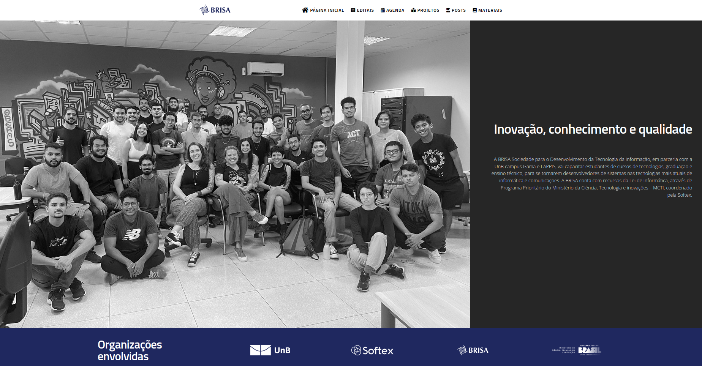
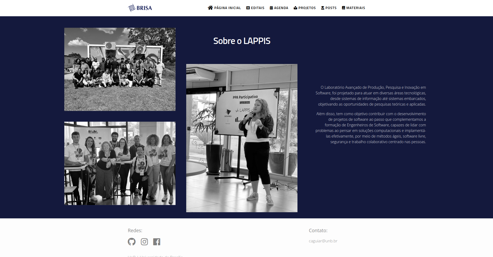
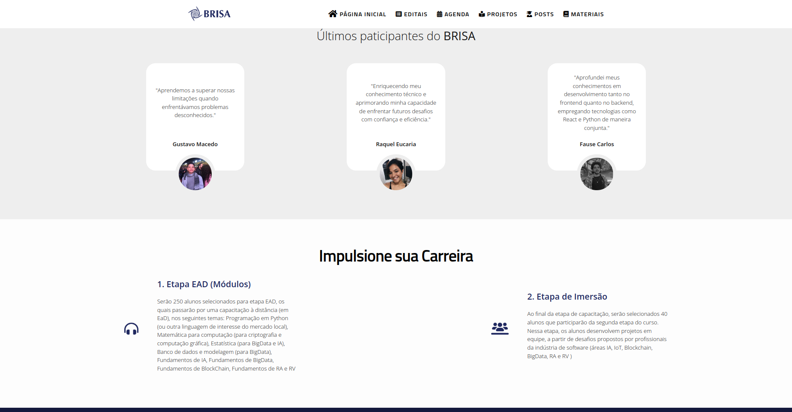

# Métodos de Desenvolvimento de Software (MDS)

Qualifying Software Engineers Undergraduates in DevOps - Challenges of introducing technical and non-technical concepts in a project-oriented course

🌐 **Site da disciplina:** [https://unb-mds.github.io/Qualifying-Software-Engineers-Undergraduates-in-DevOps/](https://unb-mds.github.io/Qualifying-Software-Engineers-Undergraduates-in-DevOps/)

## 📚 Publicações

- [Publication at ICSE - International Conference on Software Engineering (2021)](https://conf.researchr.org/details/icse-2021/icse-2021-Software-Engineering-and-Education-Track/15/Qualifying-Software-Engineers-Undergraduates-in-DevOps-Challenges-of-introducing-te)
- [Link to Preprint](https://arxiv.org/pdf/2102.06662.pdf)

## 📖 Material da Disciplina

Neste repositório você encontra material complementar para a disciplina MDS, incluindo artigos, livros, vídeos e apresentações. O objetivo é fornecer um ambiente de aprendizado aberto e colaborativo.

---

## 🚀 Como Rodar Localmente

### Opção 1: Usando Docker (Recomendado)

A forma mais fácil de rodar o projeto é usando Docker:

```bash
# Clone o repositório
git clone https://github.com/unb-mds/Qualifying-Software-Engineers-Undergraduates-in-DevOps.git
cd Qualifying-Software-Engineers-Undergraduates-in-DevOps

# Inicie o container
docker-compose up
```

O site estará disponível em **http://localhost:4000**

#### Comandos úteis do Docker:

| Comando | Descrição |
|---------|-----------|
| `docker-compose up` | Inicia o servidor |
| `docker-compose up --build` | Rebuild e inicia (após mudanças no Dockerfile) |
| `docker-compose down` | Para o container |
| `docker-compose up -d` | Inicia em background |

### Opção 2: Instalação Manual com Jekyll

```bash
# Instale o Ruby e o Bundler
gem install bundler

# Clone o repositório
git clone https://github.com/unb-mds/Qualifying-Software-Engineers-Undergraduates-in-DevOps.git
cd Qualifying-Software-Engineers-Undergraduates-in-DevOps

# Instale as dependências
bundle install

# Inicie o servidor
bundle exec jekyll serve
```

O site estará disponível em **http://localhost:4000**

---

## 📝 Como Adicionar Novos Conteúdos

### Adicionar Material na aba "Materiais"

Os materiais são gerenciados pelo arquivo `_data/materials.yml`. Para adicionar um novo material:

1. Abra o arquivo `_data/materials.yml`
2. Adicione uma nova entrada seguindo o formato:

```yaml
items:
- curse_name: Nome do Material
  url: https://link-para-o-material.com
  description: Descrição breve do material e seu conteúdo.
  author: https://github.com/seu-usuario.png
```

#### Exemplo completo:

```yaml
items:
- curse_name: Git tutorial | Introdução
  url: https://github.com/giovanni1106/tutorial-git
  description: Um tutorial introdutório de Git, que visa ensinar os fundamentos do Git.
  author: https://github.com/giovanni1106.png

- curse_name: Introdução ao Docker
  url: https://github.com/seu-usuario/tutorial-docker
  description: Tutorial prático sobre containerização com Docker e Docker Compose.
  author: https://github.com/seu-usuario.png
```

### Adicionar Slides/Apresentações

Os slides ficam na pasta `static_files/presentations/`. Para adicionar:

1. Coloque o arquivo PDF em `static_files/presentations/`
2. O arquivo estará disponível em `/static_files/presentations/nome-do-arquivo.pdf`

### Adicionar Eventos/Aulas

Os eventos ficam na pasta `_events/`. Crie um arquivo `.md` com o formato:

```markdown
---
title: "Título da Aula"
date: 2025-03-15
---

Descrição do conteúdo da aula.
```

---

## 📁 Estrutura do Projeto

```
├── _config.yml          # Configurações do Jekyll
├── _data/
│   ├── materials.yml    # Lista de materiais
│   ├── nav.yml          # Menu de navegação
│   └── ...
├── _events/             # Eventos e aulas
├── _includes/           # Componentes HTML reutilizáveis
├── _layouts/            # Templates de página
├── _sass/               # Estilos SCSS
├── static_files/        # Arquivos estáticos (PDFs, imagens)
├── project.md           # Página do Plano de Ensino
└── index.md             # Página inicial
```

---

## 🖼️ Screenshots


<br>



---

## 📧 Contato

- **Professora:** Carla Rocha - caguiar@unb.br
- **Local:** UnB - FCTE - Lab Livre
- **GitHub:** [github.com/unb-mds](https://github.com/unb-mds)