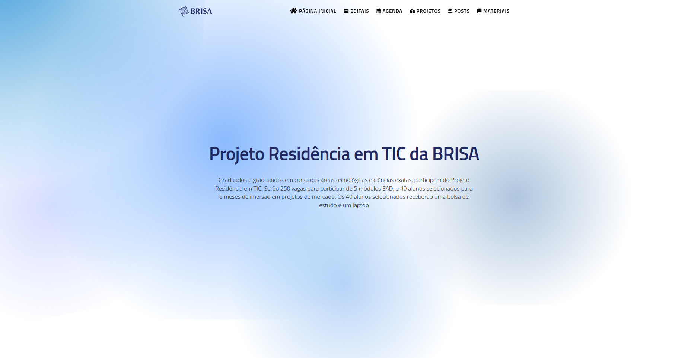

# APRESENTAÇÃO?
 É um processo que norteará a seleção e contratação de alunos para
o programa de Residência em TIC, conduzido pela BRISA – Sociedade para o Desenvolvimento
da Tecnologia da Informação –, em parceria com a Faculdade UnB Gama, com apoio da SOFTEX
– Associação para Promoção da Excelência do Software Brasileiro – e do MCTI – Ministério da
Ciência, Tecnologia e Inovação.

# QUAL OBJETIVO?
Formar profissionais qualificados em programação avançada para atender às demandas
do mercado de Brasília, Distrito Federal e entorno.

# PÚBLICO ALVO:
 São elegíveis a participarem do programa as pessoas que forem:  
Graduados e graduandos em curso das áreas tecnológicas e ciências exatas
(engenharia, computação, física, matemática, química etc.)  Formados em cursos técnicos de nível médio.

# NOSSA PÁGINA:
Nossa página foi feita com muito amor para acesso a mais imormações sobre o projeto do BRISA. 

 

# Como rodar localmente:

    Install Jekyll (Guia de instalação)
    Clone seu repositório
    Assista seu site enquanto edita: bundle exec jekyll serve
